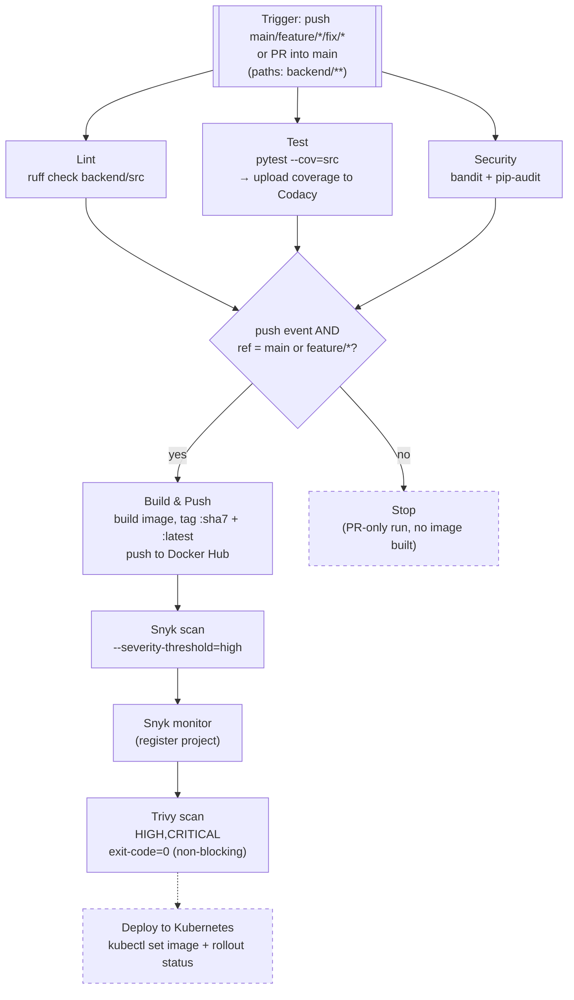
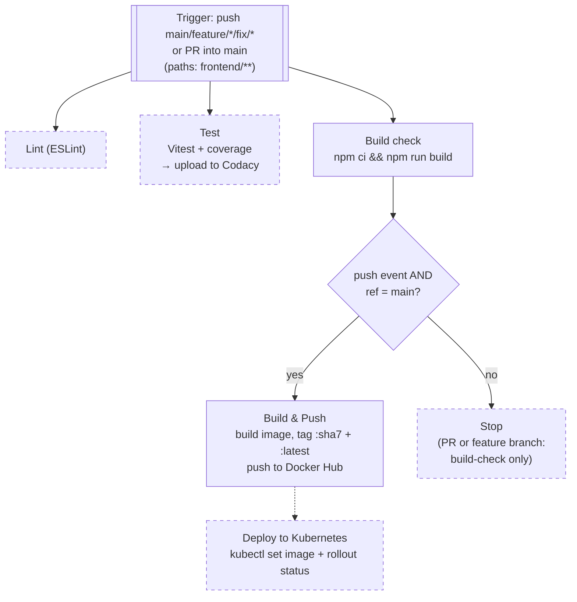
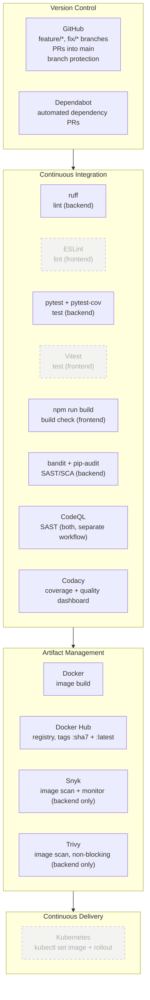

# CI/CD Pipeline Diagrams

Visual representation of the current pipelines defined in
[`.github/workflows/backend-cicd.yml`](.github/workflows/backend-cicd.yml) and
[`.github/workflows/frontend-cicd.yml`](.github/workflows/frontend-cicd.yml).
See [CICD.md](CICD.md) for the full practice checklist.

Legend: solid boxes/arrows = active jobs; dashed boxes/arrows = commented out in the workflow file (not currently running).

---

## Backend pipeline

Triggers: `push` (`main`, `feature/*`, `fix/*`) or `pull_request` (`main`), scoped to `backend/**` changes.

Notes:
- `build-and-push` runs on **both** `main` pushes and `feature/*` pushes — every feature branch gets an image built and scanned.
- Trivy is set to `exit-code: 0`, so it reports but never fails the build; Snyk's `--severity-threshold=high` can fail the job.
- `deploy` is fully commented out — scaffolded but inactive.

---

## Frontend pipeline

Triggers: `push` (`main`, `feature/*`, `fix/*`) or `pull_request` (`main`), scoped to `frontend/**` changes.

Notes:
- Lint and Test jobs are commented out entirely — only the `build` (compile check) job actually runs today.
- No security scanning (npm audit, Trivy/Grype) or Codacy integration is wired up yet, unlike the backend.
- `build-and-push` only triggers on `main` (not on `feature/*`, unlike the backend), so feature branches never get a pushed image.
- `deploy` is commented out — same as backend.

---

## Key asymmetries between the two pipelines

| Aspect | Backend | Frontend |
|---|---|---|
| Lint | ✅ active (ruff) | ⬜ disabled (ESLint commented out) |
| Unit tests + coverage | ✅ active (pytest + Codacy) | ⬜ disabled (Vitest commented out) |
| Security scanning pre-build | ✅ bandit + pip-audit | ⬜ none |
| Image scanning | ✅ Snyk + Trivy | ⬜ none |
| Builds images on feature branches | ✅ yes | ⬜ no (main only) |
| Deploy to k8s | ⬜ scaffolded, disabled | ⬜ scaffolded, disabled |

---

## Pipeline by stage (tool map)

A stage-oriented view across both services — what tool handles each stage, regardless of frontend/backend workflow boundaries.

Notes:
- Dashed nodes (ESLint, Vitest, Kubernetes deploy) exist in the workflow files but are commented out today — planned, not active.
- Codacy and CodeQL are cross-cutting: Codacy ingests coverage from both services' test jobs; CodeQL runs as its own workflow ([`.github/workflows/codeql.yml`](.github/workflows/codeql.yml)) rather than inside the frontend/backend pipelines.
- Artifact management is backend-heavy: Snyk and Trivy only scan the backend image — the frontend image is built and pushed with no scanning at all.
- Continuous Delivery has no active tooling yet; the Kubernetes step is scaffolded in both workflows but disabled, so today's pipelines stop at "image pushed to Docker Hub."
